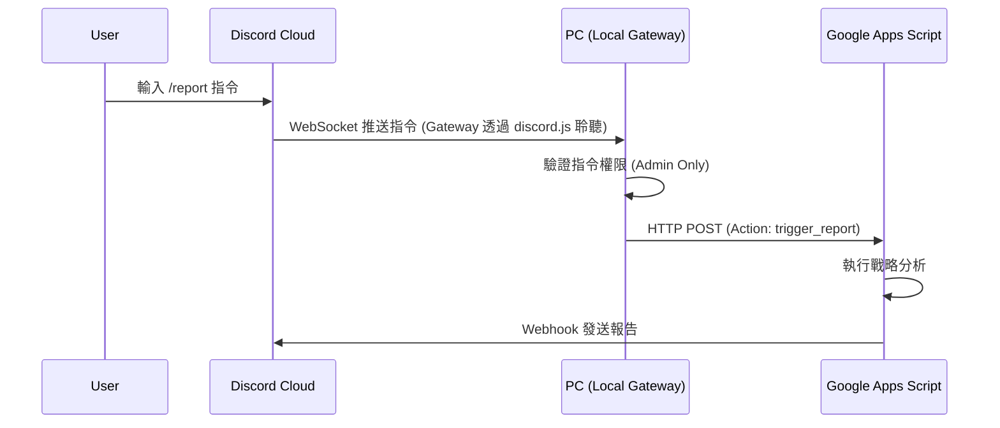

# [Design] Personal Gateway Upgrade (Local Bridge v2)

**日期**: 2026-01-24
**狀態**: 草案 (Draft)

## 1. 問題陳述
目前 `Gas_Asset_Tracker` 的報告發送是單向的（GAS -> Discord）。用戶希望透過 Discord 指令（如 `/report`）主動觸發報告。
由於 GAS 本身無法作為長期在線的 WebSocket 客戶端（Discord Bot 需要），且 HTTP Interaction Endpoint 驗證複雜，我們需要一個「中間人」來處理指令。

## 2. 核心概念：Personal Gateway (個人閘道器)
您目前的 `Start-Binance-Bridge.ps1` 其實已經是一個微型的 Gateway。它目前只做一件事：
- **流量轉發 (Tunnel)**: `GAS` -> `Cloudflare` -> `Local PC` -> `Binance API`

我們計畫將其升級為 **Gateway v2**，增加第二個功能：
- **指令中樞 (Command Center)**: `Discord` <-> `Local PC (Bot)` -> `GAS Webhook`

這將把您的電腦變成一個強大的自動化邊緣節點 (Edge Node)，不僅是 Pass-through，還具備主動邏輯。

## 3. 方案選擇
我們選擇 **方案 A: 升級 Local Bridge**。

| 特性 | 方案 A (Local Bridge) | 方案 B (Cloudflare Workers/GAS) |
|------|----------------------|--------------------------------|
| **架構** | 利用現有 Node.js Process | 需新增外部服務 (Serverless) |
| **成本** | $0 (利用閒置算力) | 免費額度限制 |
| **延遲** | 極低 (WebSocket 即時) | 需冷啟動時間 |
| **複雜度** | 低 (整合在單一腳本) | 高 (需處理 Ed25519 簽章) |
| **隱私** | Token 存在本地 | Token 存在雲端 |

**結論**：既然您已經有穩定運行的 `local-bridge`（且具備開機自啟動功能），這是最自然、最符合第一性原理的演進方向。

## 4. 架構設計

### 4.1 資料流 (Command Flow)

### 4.2 必要變更

#### A. Local Bridge (`Start-Binance-Bridge.ps1`)
1. **新增依賴**: `npm install discord.js`。
2. **新增配置**: 在 `run_bridge` 流程中加入 `DISCORD_TOKEN` 的輸入與儲存（存於 `secret.txt` 或獨立檔案）。
3. **Bot 邏輯**:
   - 啟動 `Client`。
   - 監聽 `interactionCreate` (斜線指令)。
   - 收到指令後，使用 `CONFIG.GAS_URL` 發送 POST 請求。

#### B. GAS (`Event_Webhook.js`)
1. **新增路由**: Case `trigger_report`。
2. **與現有功能整合**: 呼叫 `Core_MainMaster.js` 或 `Record_DailySnapshot.js` 中的報告生成函數。

## 5. 安全性考量
- **Token 安全**: Discord Token 僅存儲於您的本地電腦，不經過任何第三方雲端。
- **權限控制**: Bot 程式碼將限制僅回應特定 User ID (您的 ID)，避免他人惡意觸發。

## 6. 執行步驟
1. **準備**: 您需要在 Discord Developer Portal 創建 Application 並取得 Token。
2. **更新 GAS**: 部署支援 `trigger_report` 的新版本。
3. **更新 Bridge**: 替換 `Start-Binance-Bridge.ps1`。
4. **驗證**: 測試指令。
